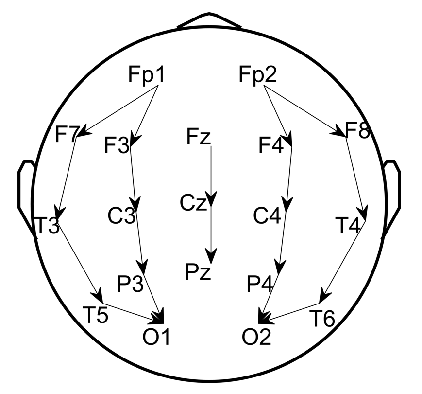
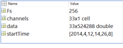

# Rapid_IIIC_Labeling_GUI

This repository describes a GUI developed by Drs. Jin Jing ("JJ"), PhD & Westover that enables rapid labeling of IIIC patterns. By following these instructions you can set up the GUI to annotate your own data. 

**Requirements:** MATLAB, EEGLAB (https://sccn.ucsd.edu/eeglab/index.php), and Python (Anaconda)

**Input data:** Raw EDF files inside .\Data\EDF\]; scalp monopolar/C2 EEG that contains a full set of 19 channels + 1 EKG (optional), with channels named as follows:

Fp1 F3 C3 P3 F7 T3 T5 O1 Fz Cz Pz Fp2 F4 C4 P4 F8 T4 T6 O2 (EKG)

**Step1:** Read EDF to MAT using EEGLAB toolbox for MATLAB. Run script step1_readEDF2MAT.m, which converts EDF format to MAT format in .\Data\MAT\ that contains the following variables:

- data: EEG array
- channels]: list of channel names in data
- Fs: the sampling rate of data
- startTime]: the start time vector of data

[Step2:]{.underline} Preprocess MAT to select/rearrange channels, resample to 200Hz , and denoise with [0.5 40Hz] band-pass and 5Hz band-stop centered at the power-line frequency ([US: 60Hz]{.mark} UK: 50Hz). Output files are saved in [.\Data\processed\]{.mark}.

{width="3.4in" height="1.149126202974628in"}

[Step3:]{.underline} run SPaRCNet (Python backend)

[Configure Python]{.underline}

Install anaconda3 and open a terminal

$ [conda create -n iiic python=3.6]{.mark}

$ [activate iiic]{.mark}

$ [conda install -c conda-forge hdf5storage]{.mark}

$ [pip install mne]{.mark}

$ [pip install torch==1.5.0+cpu torchvision==0.6.0+cpu -f https://download.pytorch.org/whl/torch_stable.html]{.mark}

[Run MATLAB wrapper]{.underline} step3_runSPaRCNat.m

CSV score table will be export to [.\Data\iiic\]{.mark}

Each row is the probabilities for 6 classes: [Other, Seizure, LPD, GPD, LRDA, and GRDA]{.mark}

Starting from the 1^st^ 10sec EEG segment and moving at 2sec step in time

Eg. row #1: scores for [0 10sec], row #2: scores for [2 12sec], ...

{width="4.6875in" height="2.84375in"}

[Step4:]{.underline} Run step4_readCSV.m to read CSV to MAT to make sure every 2sec segment got scores. The output files are saved in [.\Data\iiic\model_prediction\]{.mark}.

[Step5:]{.underline} Run step5_computeSpectrograms to get regional average spectrograms in [.\Data\Spectrograms\]{.mark}, which contains the following variables:

[Sdata]{.mark}: 4 regional average spectrograms

[stimes]{.mark}: time coordinates

[sfreqs]{.mark}: frequency coordinates

[params]{.mark}: spectrogram parameters

[Step6:]{.underline} Compute embedding map (PaCMAP) and wrap all inputs into one task folder for each patient

Configure PaCMAP (Python library: https://github.com/YingfanWang/PaCMAP)

Run step6_prepare4GUI.m

{width="6.5in" height="6.253472222222222in"}

[Step7:]{.underline} Run GUI CMGUI_Sequential_BoWspreading_v3.m inside the task folder [.\Task\subject01\]{.mark}

{width="1.84375in" height="1.2083333333333333in"} input rater initials to store scores.

{width="6.5in" height="3.897222222222222in"}click [Start]{.mark} to continue.

Enter Phase #I: label K=50 clusters in a row.

{width="6.5in" height="3.897222222222222in"}

Enter Phase #2: sequential inspect all labels.

{width="6.5in" height="3.897222222222222in"}

Press [Done]{.mark} button to seal and export the labels.

{width="6.5in" height="3.8860968941382326in"}

Please refer to slides on detailed instructions.
